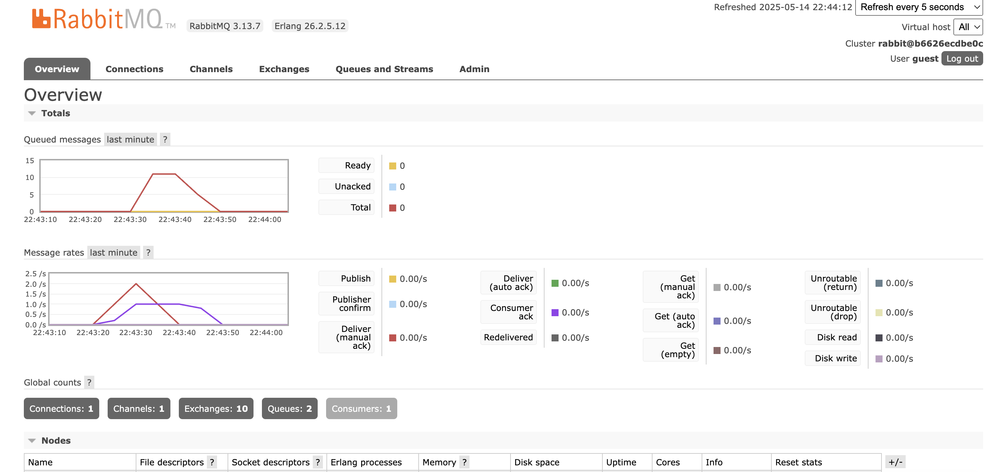
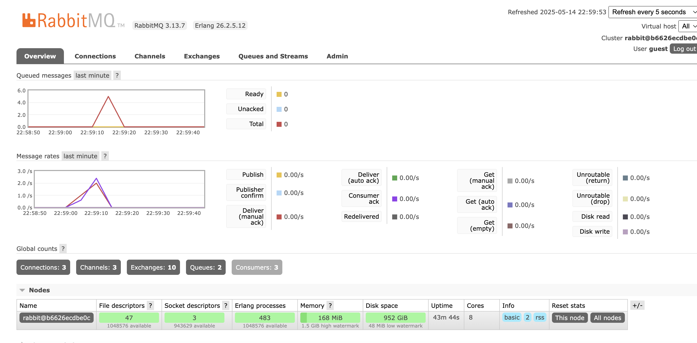

## What is AMQP? ##

AMQP stands for Advanced Message Queuing Protocol.
It is an open standard protocol for message-oriented middleware. AMQP allows applications to communicate with each other by sending messages through queues, and it also decouples the sender and receiver. 

## What does this mean: guest:guest@localhost:5672? ##
The first guest is the username.The second guest is the password. localhost refers to your local machine. 
5672 is the default port that RabbitMQ uses for AMQP connections.

## Simulation Slow Subscriber ##

the total number is around 11-12. It's because the publisher is sending messages at a faster
rate than what the subscriber can take in. which causes the messages to pile up in the queue.

## Reflection and Running at least three subscriber ##

The queue now only has 5 messages before emptying out immediately. The backlog cleared really fast because
the publisher pushed multiple messages all at once and I used three subscribers that processes them concurrently. This shows that
increasing amount of consumers will prevent queue buildup if the publisher is operating quickly

